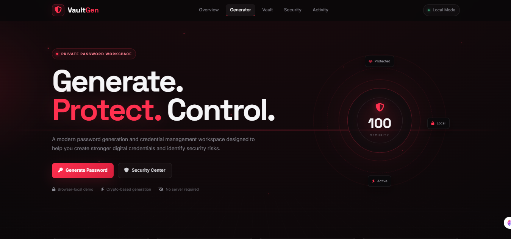
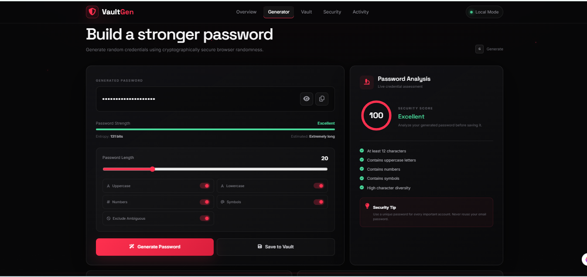
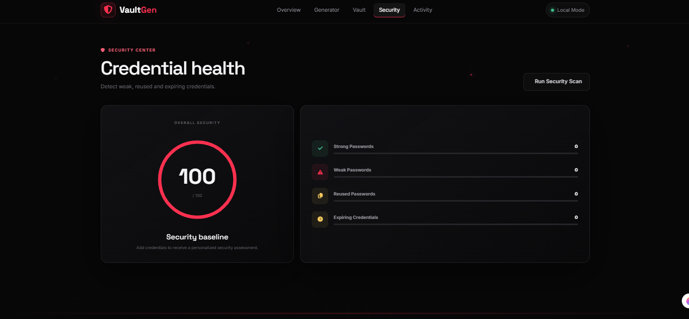

# 🔐 VaultGen

A modern browser-based password manager and security toolkit built with HTML, CSS, and JavaScript.

## ✨ Features

- 🔑 Secure password generator
- 📊 Password strength analysis
- 🧮 Entropy and estimated crack-time calculation
- 👤 Username generator
- 🧩 Passphrase generator
- 💾 Saved accounts
- 🔄 Password history
- 🛡️ Security dashboard
- 🔎 Search and filter accounts
- ⭐ Favorite accounts
- 📋 Copy passwords with auto-clear
- 📥 Import account data
- 📤 Export account data
- ⚙️ Security settings
- ⌨️ Keyboard shortcuts
- 📱 Responsive design
- ✨ Animated cybersecurity-themed interface

## 🛠️ Technologies

- HTML5
- CSS3
- JavaScript
- Web Crypto API
- LocalStorage
- Font Awesome
- Google Fonts
  
##  📸 Preview

### 🏠 Home

### 🔐 Password Generator

### 🛡️ Security Dashboard

